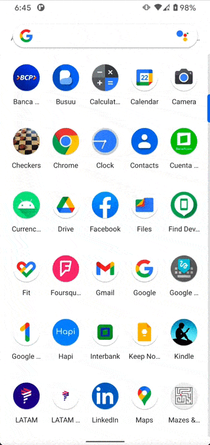

# Currency Exchange

Proyecto demo, que permite cambiar divisas entre Soles, Dólares y Euros.

## Configuraciones iniciales

- Descargue el proyecto de [Github](https://github.com/RicardoBravoA/CurrencyExchange), la rama actualizada es **master**

- Inicie el servidor, ingresando a la ruta `~/CurrencyExchange/backend/` y escriba el comando

```bash
node index.js
```

- Debe aparecer el siguiente mensaje

```bash
The server is running in port 3000
```

- Recuerde que la url que debe actualizar es la IP de su PC con el puerto 3000

```bash
object Constant {

    const val BASE_URL = "http://192.168.1.50:3000/api/"
}
```

- Actualice `BASE_URL`, la url de su servidor en `com.rba.currency.data.util.Constant`

### Dependencias

El proyecto usa las siguientes dependencias

- Retrofit
- OkHttp
- Coroutines
- AndroidX
- Material Components
- Navigation Components
- Glide


## Justificación

The project tiene las siguientes funcionalidades.

<p align="center">
  <br>
</p>

- Se está utilizando Clean Architecture y MVVM en la capa de presentación, además de tener módulos en data, dominio, presentación y el custom view; de esta manera el proyecto se hace escalable y fácil de testear

- Me hubiera gustado agregarle soporte para el modo offline, almacenando la data en room, pero debido a que el desafío ha sido en día de semana y me encuentro laborando full time, no he tenido mucho tiempo para dedicarle al test.

- Se creó un backend simple usando express, para simular las respuestas de los web services

- Por el poco tiempo me hubiera gustado obtener la url del backend desde el archivo `local.properties` del usuario

- Se hizo solo un test para `CountryDataSource` del módulo data

## License

    Copyright 2021 Ricardo Bravo (Woz).

    Licensed under the Apache License, Version 2.0 (the "License");
    you may not use this file except in compliance with the License.
    You may obtain a copy of the License at

       http://www.apache.org/licenses/LICENSE-2.0

    Unless required by applicable law or agreed to in writing, software
    distributed under the License is distributed on an "AS IS" BASIS,
    WITHOUT WARRANTIES OR CONDITIONS OF ANY KIND, either express or implied.
    See the License for the specific language governing permissions and
    limitations under the License.